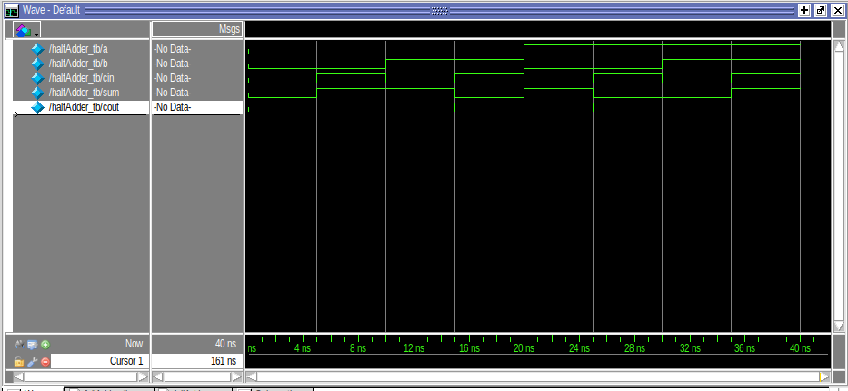
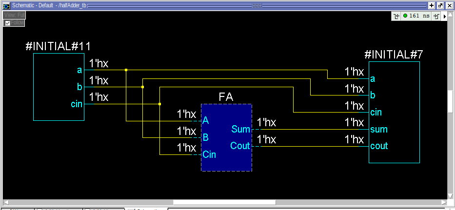
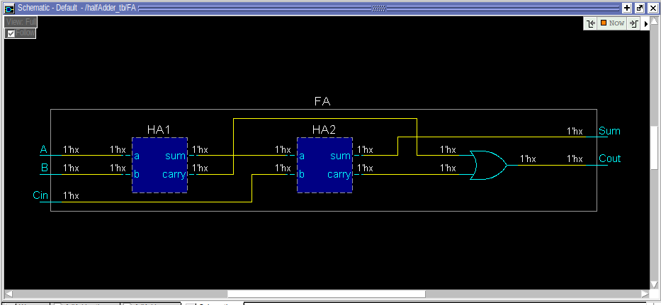
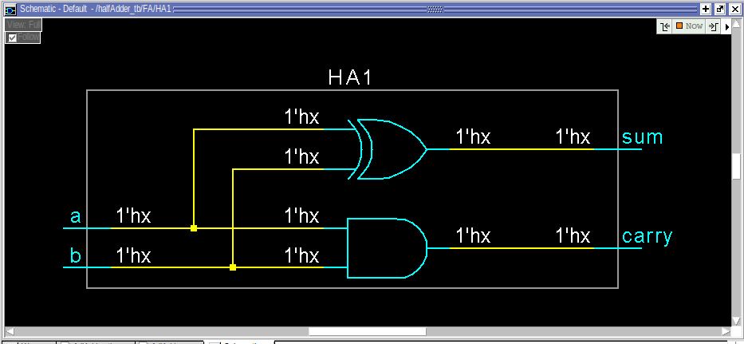

# FullAdder

A basic Verilog HDL implementation of a full adder digital circuit.

## Table of Contents
- [Introduction](#introduction)
- [Project Structure](#project-structure)
- [Design and Implementation](#design-and-implementation)
- [Simulation](#simulation)
- [Files Overview](#files-overview)
- [How to Use](#how-to-use)
- [Dependencies](#dependencies)
- [License](#license)

## Introduction

This project demonstrates the design and simulation of a full adder using Verilog. The full adder is a fundamental combinational logic circuit that takes three input bits and produces a sum and carry output.

## Project Structure

The project is organized as follows:

- `src/rtl/`: Contains the Verilog code for the basic gates.
    
- `sim/`: Contains all simulation-related files.
    - `testbench/`: Contains the Verilog testbench code to simulate and verify the halfadder modules.
    - `result/images/`: Contains the images for the simulation results:

## Design and Implementation

### Verilog Modules

The full adder is implemented in the `src/rtl/fullAdder.v` file. 

### Testbenches

The testbenches are written in the `sim/testbench` directory and are responsible for simulating the full adder with all possible input combinations to verify correctness.

### Simulation Results

Simulation results are stored in the `sim/result/images/` directory and include:
- **Waveform**: The waveform generated during the simulation that shows the signal transitions halfadder output.
  
- **Schematic**: A general schematic representation of the gate-level design.
  
- **Schematic**: A more detailed schematic.
  
- **Schematic**: Half adder schematic.
  
  
## Files Overview

Here’s a brief overview of the files in the repository:

### `src/rtl/`
- **`fullAdder.v`**: Verilog module that contains the implementation of fulladder.

### `sim/`
- **`testbench/`**: Contains the testbench files for simulating the fulladder. For example:
    - **`fullAdder_tb.v`**: Testbench to simulate the gates in `fullAdder.v`.
    
- **`result/images/`**: Contains the images of the simulation results:
    - **`waveform.png`**: A screenshot of the waveform of the simulation.
    - **`schematic.png`**: The schematic diagram of the design.
    - **`gatelevelschematic.png`**: The gate-level schematic of the design.
### `Theory`
- **`fullAdder.jpg`**: Is a image where the truth table Kmap boolean equationan and the circuit is shown for reference.
- **Theory**:
  

## How to Use

### Requirements

To run the simulation, you will need **QuestaSim** (or **ModelSim**, which is the same simulator suite):
- [QuestaSim](https://www.mentor.com/products/fpga/questasim) or [ModelSim](https://www.mentor.com/products/fpga/modelsim)

### Viewing the Simulation Results

You can view the simulation waveform and other images in the `sim/result/images/` directory, such as:
- **`waveform.png`**: View the signal transitions for each gate's output.
- **`schematic.png`**: View the schematic diagram of the gate-level design.
- **`gatelevelschematic.png`**: View the gate-level schematic representation of the design.

## Dependencies

- **QuestaSim** or **ModelSim** (for simulation)
- Text editor for Verilog code (Visual Studio Code, Sublime Text, etc.)

## License

This project is open-source and available under the [MIT License](LICENSE).
