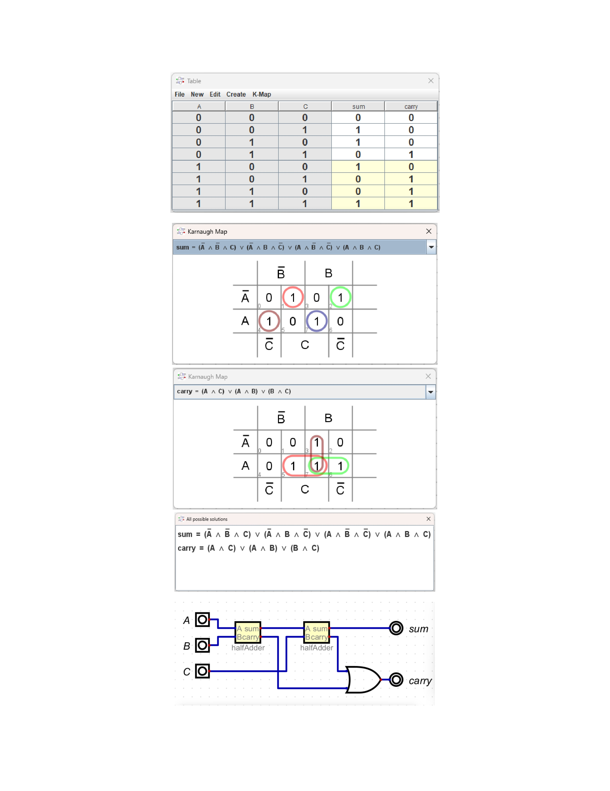

Full Adder Using Hierarchical Modeling (Built from Two Half Adders)
🧩 Introduction
A Full Adder is a fundamental combinational logic circuit that performs the addition of three 1-bit inputs: A, B, and Cin (carry-in). It produces two outputs: Sum and Cout (carry-out).
In this project, the full adder is designed using a hierarchical modeling approach, where two half adders are connected along with an OR gate to construct the complete full-adder functionality. This demonstrates how smaller, reusable modules can be composed to build more complex digital systems.

🏗️ Project Structure
fulladder-using-halfadder/
│
├── src/rtl/                # Verilog RTL design files (half adder + full adder)
│
├── sim/testbench/          # Testbench files to verify the design
│
├── sim/result/image/       # Simulation results (waveforms + schematic diagrams)
│
└── theory/                 # Circuit truth table, K-map, Boolean equations

🔧 Design Approach
✔ Hierarchical Model
The full adder is built by instantiating two half adder modules:
Half Adder 1 → adds A and B
Half Adder 2 → adds the Sum from HA1 with Cin
An OR gate combines the carry outputs of both half adders → produces Cout
This modular design improves readability, reusability, and testing simplicity.

📁 Included Files
1. RTL Design (src/rtl/)
Contains:
half_adder.v
full_adder.v
These files implement the combinational logic in Verilog HDL.

2. Testbench (sim/testbench/)
Contains Verilog testbench to verify all input combinations and validate the Sum and Carry outputs.

3. Simulation Results (sim/result/image/)
Includes:
Schematic diagrams of the full adder
Waveform outputs generated after simulation
Full Adder Schematic:

Simulation Waveform:

5. Theory (theory/)
Contains the conceptual documentation including:
Truth Table
K-Map simplification
Boolean equations
Circuit diagram designed in Digital Logic Simulator

Theory Image:

🧪 Verification
The testbench exhaustively tests all 8 input combinations of A, B, and Cin.
It verifies:
Correct Sum generation
Correct Carry-Out behavior
Proper hierarchical functioning of cascaded half adders

📜 Summary
This project demonstrates how a full adder can be efficiently implemented using two half adders, highlighting the advantages of hierarchical design in digital systems. The repository contains complete RTL code, testbenches, simulation outputs, and theoretical documentation.
